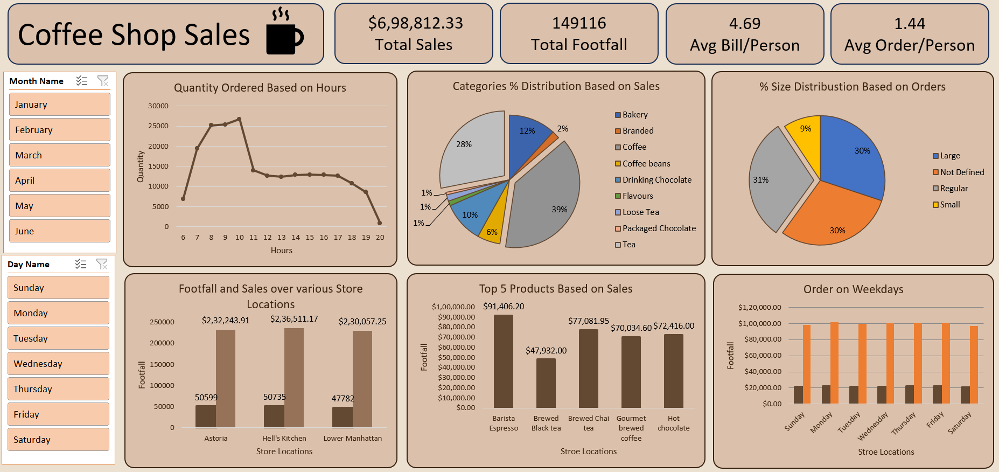

# ☕ Coffee Sales Dashboard (Excel)

## 📌 Project Overview

This project is an interactive Coffee Sales Dashboard built in Microsoft Excel to analyze coffee sales performance across different products, customers, countries, and time periods.

The dashboard transforms raw sales data into meaningful business insights, helping stakeholders identify sales trends, top-performing products, valuable customers, and revenue growth opportunities.

---

## 🎯 Business Objective

The goal of this project is to provide a clear and data-driven view of coffee sales performance by answering key business questions:

- Which coffee products generate the highest sales?
- Which customers contribute the most revenue?
- Which countries drive the largest sales volume?
- How do sales trends change over time?
- What opportunities exist to improve business performance?

---

## 📊 Dashboard Highlights

✅ Interactive Dashboard

✅ Dynamic Filters & Slicers

✅ Sales Trend Analysis

✅ Top Customers Analysis

✅ Product Performance Tracking

✅ Country-wise Sales Analysis

✅ Revenue Insights & KPIs

---

## 🛠️ Tools & Skills Used

- Microsoft Excel
- Pivot Tables
- Pivot Charts
- Slicers & Timelines
- XLOOKUP
- INDEX-MATCH
- Data Cleaning
- Data Analysis
- Dashboard Design
- Business Intelligence

---

## 📈 Key Insights

- Identified best-selling coffee products.
- Analyzed top revenue-generating customers.
- Compared sales performance across countries.
- Tracked monthly and yearly sales trends.
- Created an interactive dashboard for quick decision-making.

---

## 🚀 Project Outcome

This dashboard enables users to monitor coffee sales performance efficiently, uncover business trends, and make data-driven decisions through a visually appealing and interactive reporting solution.

### 📷 Dashboard Preview

---

⭐ If you found this project interesting, feel free to explore the repository and share your feedback!
